# RetailAI.os

> AI-Powered Business Operations Platform for Modern Retail Businesses

---


---

## 📋 Project Information

- **Project Type:** Team Project / Web Application
- **Domain:** Retail Business Operations & Intelligence
- **Architecture:** Client-Server Architecture (Vanilla JS Frontend + Python Flask REST API + PostgreSQL + AI Copilot)
- **User Roles:** Admin, Manager, Cashier, Staff
- **AI Integration:** Google Gemini API Integration (`gemini-3.5-flash-lite`)
- **Status:** Fully functional and active development

---

## Overview

RetailAI.os is a web-based business operations platform designed to help retail businesses manage their day-to-day operations from a centralized system.

The platform brings together sales, inventory, products, customers, suppliers, procurement, expenses, reporting, and AI-powered business assistance into a single application.

---

## Problem Statement

Traditional and modern retail businesses frequently encounter critical operational bottlenecks due to fragmented management practices:

- **Operational Silos:** Managing sales, inventory, procurement, expenses, and customer records across disconnected spreadsheets or manual ledgers leads to data duplication and communication gaps.
- **Stock & Financial Discrepancies:** A lack of real-time synchronization between point-of-sale transactions and inventory levels results in stockouts, overstocking, and poor tracking of supplier liabilities and cash flows.
- **Complex Performance Tracking:** Business owners and managers struggle to aggregate daily metrics, evaluate expense outflows, and assess profitability quickly without extensive manual compilation.
- **Absence of Intelligent Insights:** Decision-making remains reactive rather than proactive due to the absence of automated telemetry and natural language business intelligence to highlight operational bottlenecks.

---

## Solution

RetailAI.os solves fragmented retail management challenges by delivering a unified platform that consolidates all core business operations into a single centralized system. 

- **Unified Platform Concept:** Brings together sales, inventory, products, customers, suppliers, procurement, and expenses so businesses no longer need to rely on disconnected ledgers or manual tracking.
- **Centralized Management:** Streamlines day-to-day workflows, allowing business owners and staff to oversee transactions, stock adjustments, and financial outflows seamlessly.
- **Role-Based Access Control:** Tailors system functionality and navigation to different user roles, ensuring administrators, managers, cashiers, and staff interact only with the features relevant to their responsibilities.
- **AI-Driven Insights:** Empowers authorized users with an embedded AI Copilot that interprets business data to deliver instant insights, analytics, and operational recommendations through natural language.
- **Data-Driven Operations:** Ultimate goal is to transform traditional retail into a structured, highly organized, and fully data-driven business environment.

---

## Key Features

### Authentication & Access
- Secure user login
- JWT-based token authentication
- Role-based access control restricting features by user permission
- Distinct access tiers for Admin, Manager, Cashier, and Staff roles

### Business Operations
- Sales transaction and point-of-sale management
- Procurement order tracking with payment status and liability monitoring
- Real-time inventory tracking and stock movement auditing
- Product catalog management with SKU tracking and pricing control
- Customer matrix management and contact tracking
- Supplier directory management and status tracking
- Expense outflow recording, categorization, and tracking

### Business Monitoring
- Executive dashboard with telemetry and summary metrics
- Sales performance overview and transaction logging
- Financial and expense visibility
- Real-time inventory status overview

### AI Capabilities
- AI-powered business insights and metric analysis
- Automated operational recommendations
- Embedded AI Copilot interface
- Natural-language querying for business telemetry and data retrieval

---

## User Roles

### Admin
- Highest-level system access and administrative control
- User account management and operational oversight
- Comprehensive business performance overview and analytics
- Access to audit logs, financial reports, and system telemetry
- Full access to the AI Copilot intelligence suite

### Manager
- Monitoring of overall business performance and sales trends
- Detailed sales analysis and revenue tracking
- Inventory level tracking, stock monitoring, and low-stock oversight
- Procurement and supplier liability visibility
- Expense outflow analysis and budget monitoring
- Access to analytical insights via AI Copilot

### Cashier
- Point-of-Sale (POS) transaction processing
- Product catalog selection and item lookup
- Customer directory selection and record mapping
- Multiple payment method handling and sales finalization
- Recent sales transaction tracking and ledger monitoring

### Staff
- Execution of role-specific operational workflows
- Assigned inventory and product catalog management
- Controlled access to designated system modules based on organizational permissions

---

## System Modules

### Dashboard
Provides a centralized executive command center with Bento grid telemetry for real-time business performance and metric summaries.

### Sales Ledger
Tracks and manages all point-of-sale transactions, sales items, and historical billing records.

### Procurement
Handles purchase orders, supplier purchase history, payment status tracking, and outstanding liability calculations.

### Inventory Grid
Monitors real-time stock levels, inventory movements, and low-stock items across storage items.

### Product Catalog
Manages master product details, pricing, SKUs, and category classifications.

### Customer Matrix
Maintains customer profiles, contact details, and customer-specific purchase data.

### Supplier Hub
Centralizes supplier directories, contact details, and supplier-wise order history.

### Expense Outflows
Logs, categorizes, and analyzes day-to-day business expenses and operational costs.

### Audit Reports
Provides transaction logs, performance metrics, and financial reporting capabilities.

### AI Copilot
Integrates natural language processing and business intelligence for automated telemetry queries and recommendations.

---

## AI Copilot

RetailAI.os includes an integrated, autonomous AI business assistant designed to help authorized users interact with their business telemetry using natural language. Instead of running manual reports or filtering complex ledgers, users can ask direct questions about their retail operations and receive immediate, context-aware answers.

### What it can do

- Answer natural-language questions regarding daily and monthly business performance.
- Provide real-time data lookups for inventory health and stock levels.
- Summarize expense outflows, categories, and financial breakdowns.
- Retrieve sales revenue figures, top-selling products, and transaction metrics.
- Track supplier procurement status and outstanding liabilities.

### Business Insights

The AI Copilot evaluates current business data context to surface meaningful telemetry trends. It aggregates raw transactional records into clear analytical summaries, highlighting top-performing categories, high-spend cost areas, and overall financial health.

### Recommendations

Beyond data retrieval, the AI Copilot offers actionable operational suggestions. It assists management by identifying potential supply chain bottlenecks, recommending inventory reorders for low-stock items, and suggesting ways to optimize business efficiency based on actual operational data.

---

## Tech Stack

### Frontend
- HTML5
- CSS3 (Custom Cyber-Glassmorphic Design System)
- Vanilla JavaScript (ES6+)
- Font Awesome Icons

### Backend
- Python
- Flask Framework
- RESTful API Architecture

### Database
- PostgreSQL
- Psycopg2 Database Adapter

### Authentication & Security
- JSON Web Tokens (JWT) for session management and stateless authorization
- Flask-JWT-Extended
- Secure password hashing and Role-Based Access Control (RBAC) middleware

### AI
- Google Gemini API (`genai.Client`)
- Model integration: `gemini-3.5-flash-lite`

### Development & Testing
- Git for version control
- GitHub repository management
- Postman for REST API endpoint validation and request-response testing

---

## Database

### Database Technology
- PostgreSQL relational database management system
- Psycopg2 database adapter for Python-PostgreSQL connectivity

### Core Entities

- `users`: Stores user credentials, roles, and administrative flags.
- `products`: Maintains master product details, pricing, categories, and SKU information.
- `inventory`: Tracks real-time stock quantities linked to inventory items.
- `inventory_movements`: Maintains an audit trail for stock adjustments and movements.
- `customers`: Stores customer profiles, contact info, and registration details.
- `suppliers`: Manages supplier organization data, contact records, and partnerships.
- `sales` & `sale_items`: Records point-of-sale transaction headers and individual line-item details.
- `purchases` & `purchase_items`: Tracks procurement orders, payment statuses (`PAID`, `PENDING`, `PARTIAL`), and liabilities.
- `expenses`: Logs operational business expenses, amounts, and category distributions.

### Relationships
The database is structured to maintain strong relational integrity across all modules. Users handle administrative actions, while sales link customers to specific product line-items through transactional tables. Similarly, purchases connect suppliers with ordered products, dynamically affecting inventory counts and expense ledgers. Inventory movements track all stock adjustments to ensure data consistency between sales, procurement, and warehouse levels.

---

## Application Screenshots

### Login
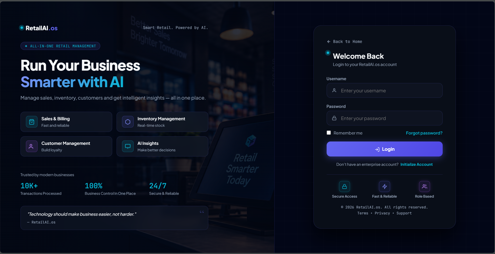

### Registration
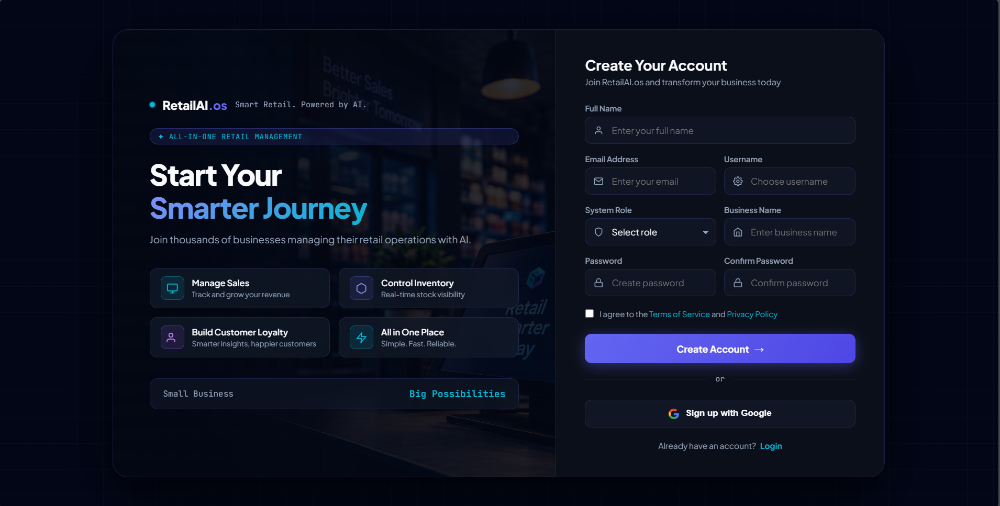

### Admin Dashboard
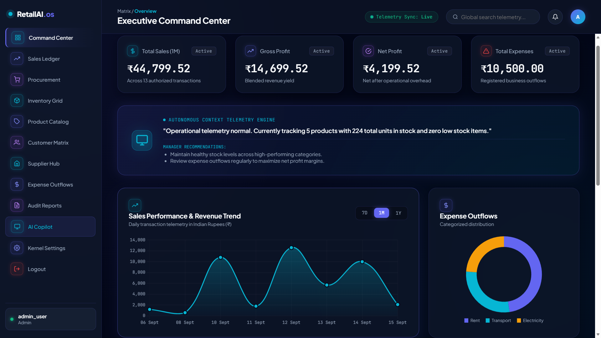

### Manager Dashboard
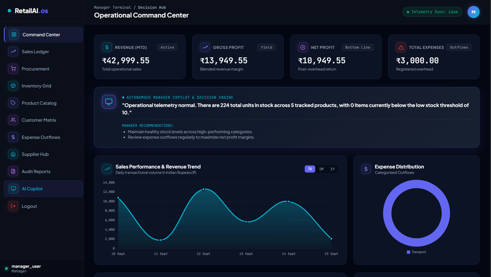

### Cashier Dashboard
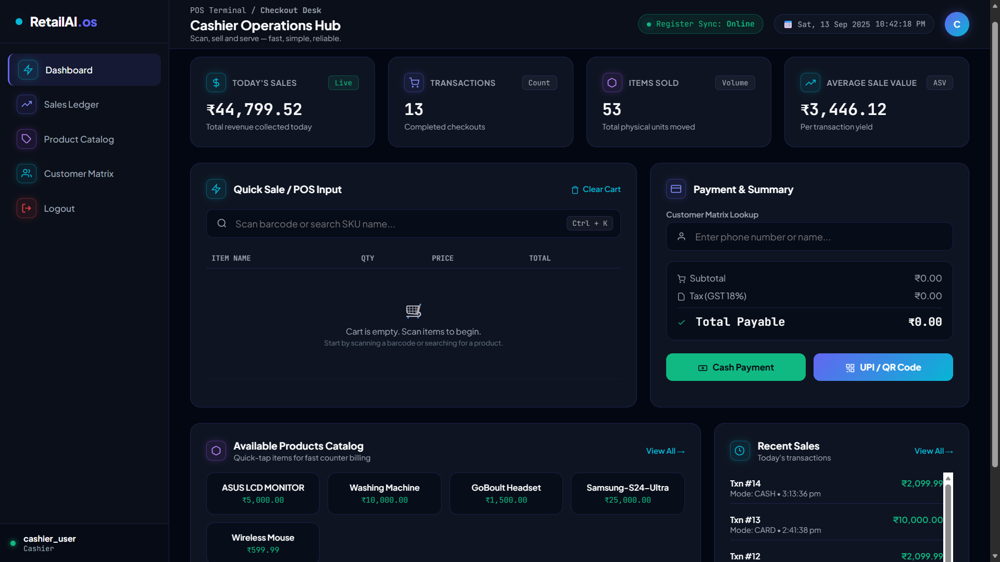

### Sales Ledger
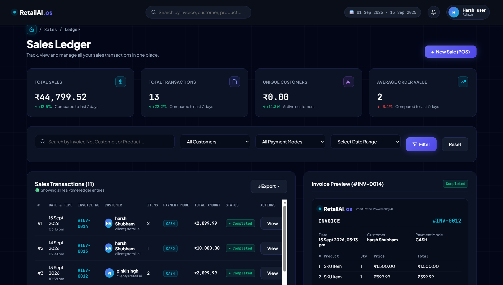

### Procurement
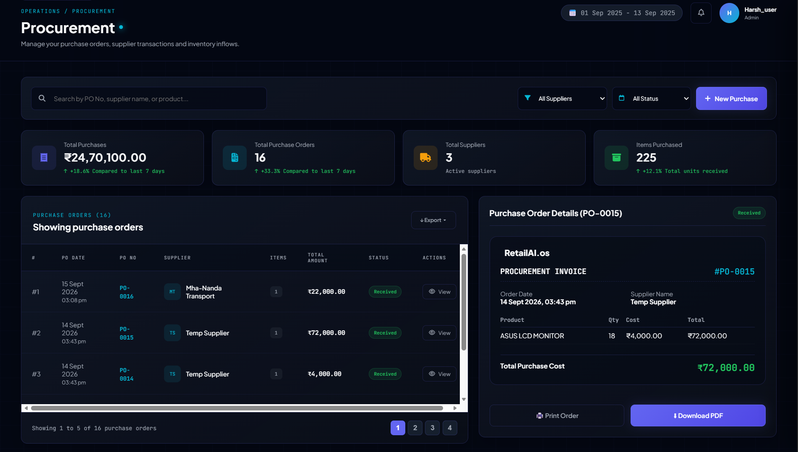

### Inventory Grid
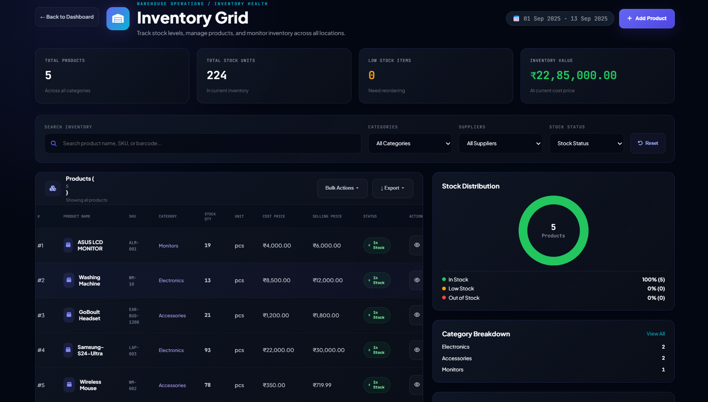

### Product Catalog
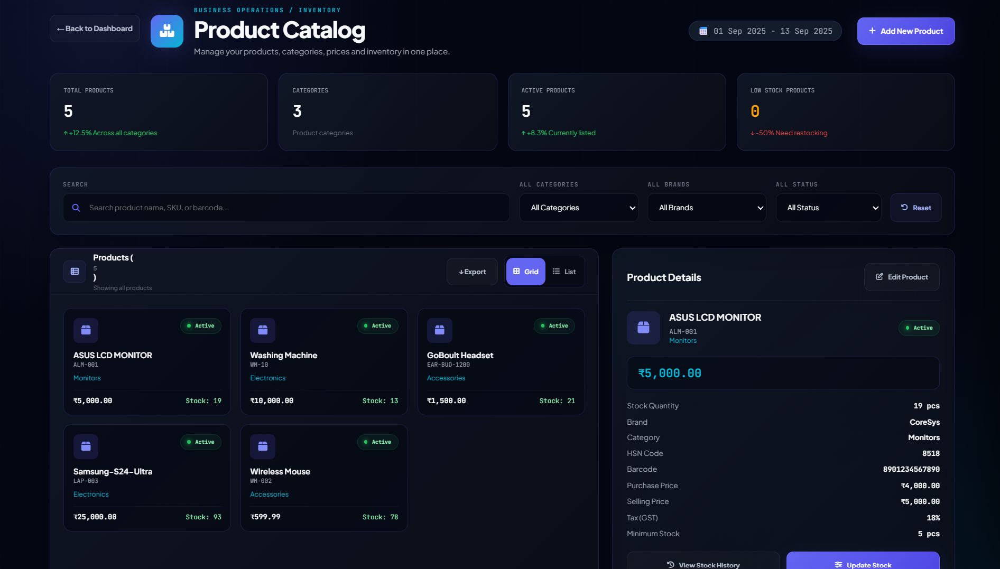

### Customer Matrix
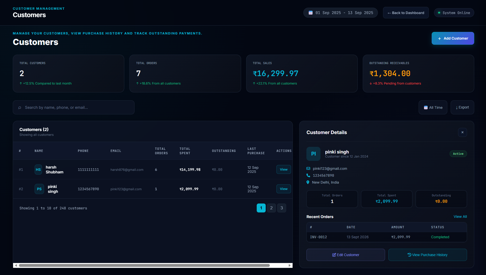

### Supplier Hub
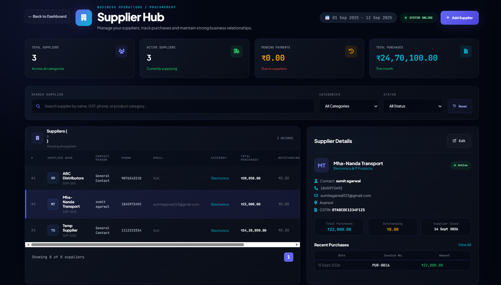

### Expense Outflows
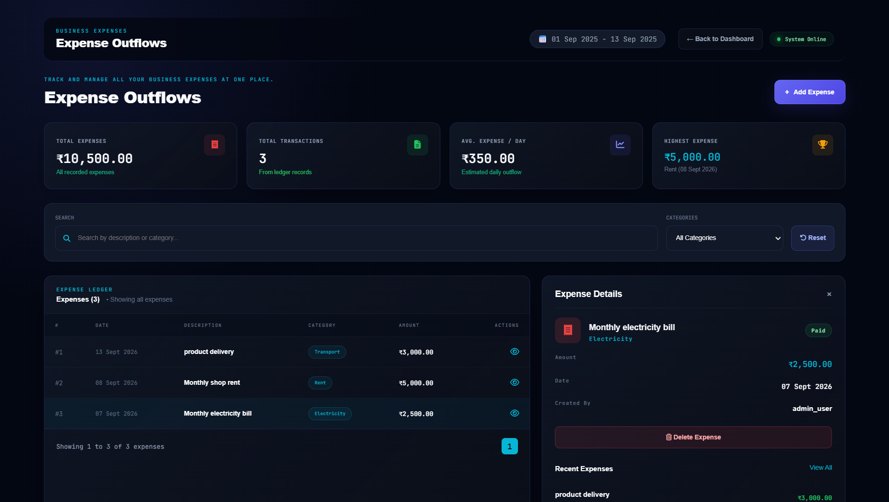

### Audit Reports
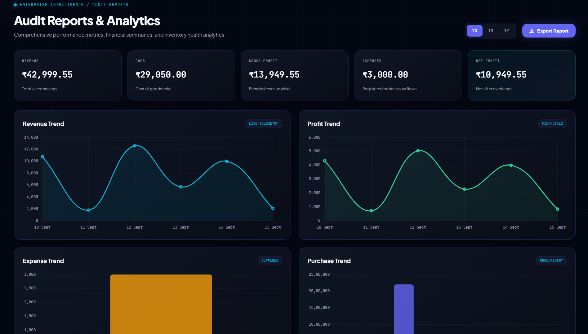

### AI Copilot
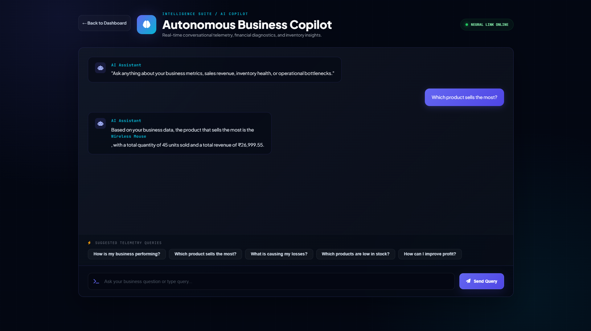

---

## Authentication & Security

### Authentication
- Stateless user authentication implemented using JSON Web Tokens (JWT).
- Upon successful login verification via credentials, the backend issues a signed JWT containing user identity and role claims.
- Client-side sessions securely store tokens and include them within the Authorization header (`Bearer <token>`) for subsequent API requests.

### Authorization
- Enforced Role-Based Access Control (RBAC) across both backend endpoints and frontend views.
- Custom decorators on backend routes restrict execution based on designated user roles (`Admin`, `Manager`, `Cashier`, `Staff`).
- Automatic redirection on the client-side prevents users from accessing unauthorized role-specific dashboards.

### Data & API Security
- Protected API endpoints validate incoming JWT tokens via middleware before processing queries or modifying database records.
- Strict request body validation and structured intent matching protect against malformed inputs and unauthorized data exposure.
- Controlled business data contexts passed to external AI services ensure internal schemas and system prompts remain isolated.

### Resource Protection
- Session validation checks are performed on page load and route transitions to verify token validity and prevent stale or unauthenticated access.
- Unauthorized or expired token states automatically trigger forced redirection back to the login portal.

---

## Project Structure

```text
RetailAI.os/
├── backend/
│   ├── assistant/         # AI Copilot integration and query processor
│   ├── auth/              # User authentication and JWT middleware
│   ├── customers/         # Customer matrix management module
│   ├── database/          # PostgreSQL connection and query handlers
│   ├── expenses/          # Expense outflow tracking module
│   ├── inventory/         # Stock management and tracking services
│   ├── middleware/        # Role verification and access control
│   ├── products/          # Product catalog services
│   ├── purchases/         # Procurement and supplier liability services
│   ├── reports/           # Business telemetry and analytics aggregation
│   ├── sales/             # POS and sales transaction handlers
│   ├── suppliers/         # Supplier relationship management module
│   ├── app.py             # Flask application entry point
│   ├── config.py          # Application configuration settings
│   └── requirements.txt   # Python dependency list
│
├── frontend/
│   ├── ai/                # AI Copilot UI views and assets
│   ├── audit_report/      # Audit and reporting interface views
│   ├── auth/              # Login and registration templates
│   ├── cashier/           # Cashier role-specific dashboard views
│   ├── customer_metrix/   # Customer management interfaces
│   ├── dashboard/         # Executive admin dashboard views
│   ├── expenses/          # Expense tracking and outflow views
│   ├── inventory/         # Inventory management and stock grid views
│   ├── manager/           # Manager role-specific dashboard views
│   ├── procurment/        # Procurement and purchasing interfaces
│   ├── product_catalog/   # Product listing and management views
│   ├── sales/             # Sales ledger and POS transaction views
│   ├── staff/             # Staff role-specific interface views
│   ├── Supplier_hub/      # Supplier management views
│   ├── index.html         # Landing/entry point view
│   ├── script.js          # Global frontend scripts
│   └── style.css          # Global cyber-glassmorphic styles
│
├── screenshots/           # Application interface screenshots
├── .gitignore             # Ignored files and directories
└── README.md              # Project documentation
```

---

## Installation & Setup

### 1. Clone the Repository
```bash
git clone [https://github.com/Retails-AI/retails-ai.git](https://github.com/Retails-AI/retails-ai.git)
cd RetailAI

cd backend
python -m venv venv
```

### 2. On Windows (Command Prompt / PowerShell):

```bash
venv\Scripts\activate
```

### 3. Install Dependencies
Install the required Python packages listed in requirements.txt:
```bash
pip install -r requirements.txt
```

### 4. Environment Variables
Create a .env file inside the backend/ directory using the following configuration template:

```bash
Code snippet
DB_HOST=localhost
DB_PORT=5432
DB_NAME=retailai_db
DB_USER=postgres
DB_PASSWORD=your_database_password
JWT_SECRET_KEY=your_jwt_secret_key
GEMINI_API_KEY=your_gemini_api_key
```
### 5. Database Setup
Ensure your PostgreSQL server is running.
```bash
Create a new database named retailai_db via pgAdmin or the PostgreSQL command line:

SQL
CREATE DATABASE retailai_db;
Execute your database schema script to initialize all required tables, relations, and constraints.
```
### 6. Run the Backend
Start the Flask backend server:

```bash
python app.py
The backend API server will run at http://127.0.0.1:5000.
```

### 7. Run the Frontend
Navigate to the frontend/ directory or serve index.html using a live server extension (such as Live Server in VS Code).

Open the application in your web browser to access the portal.

---

## Application Workflow

```text
User
 ↓
Login
 ↓
Authentication
 ↓
Role Identification
 ↓
Role-specific Dashboard
 ↓
Business Operations
 ↓
Database
 ↓
Reports / Insights
 ↓
AI Copilot
```
## Operational Flow

- **Authentication & Routing:** Users log in through the portal, submitting credentials to receive a signed JWT token. The system validates the token and identifies the assigned user role to route them directly to their respective role-specific dashboard (`Admin`, `Manager`, `Cashier`, or `Staff`).
- **Core Interactions:** Users interact with authorized business modules such as the POS sales ledger, inventory grid, product catalog, customer matrix, or supplier procurement hub.
- **Data Persistence:** Operations, transactions, and inventory adjustments are transmitted via RESTful APIs to the Flask backend, which processes and securely updates the PostgreSQL database records.
- **Reporting & Telemetry:** Dashboards and reporting modules aggregate the updated data to present real-time business metrics, expense outflows, and transaction histories.
- **AI-Powered Assistance:** Authorized personnel can query the system via the AI Copilot interface, which securely accesses controlled business data context to deliver instant analysis and operational recommendations.

### AI Processing Flow

```text
User Query
    ↓
AI Request
    ↓
Gemini API (`gemini-3.5-flash-lite`)
    ↓
Success → Response
```
### Query Handling: 
User inquiries entered into the AI Copilot are packaged with the current controlled business data context and transmitted to the Google Gemini model for evaluation and natural language response generation.

---

## 🧪 Testing

### API Testing
- All RESTful API endpoints across modules (Sales, Procurement, Inventory, Products, Customers, Suppliers, and Expenses) were rigorously validated using Postman to verify correct request contracts, HTTP response codes, and JSON payload structures.
- Verified that GET, POST, PUT, and DELETE operations correctly handle header parameters and payload attributes.

### Authentication & Authorization
- Tested JWT token generation upon successful login credentials submission.
- Verified that protected routes correctly reject requests lacking the Authorization header or containing expired tokens.
- Validated Role-Based Access Control (RBAC) restrictions, ensuring that users with roles such as `Cashier` or `Staff` are successfully blocked from accessing administrative or manager-level endpoints and views.

### Business Operations Testing
- **Sales Transactions:** Validated point-of-sale processing, cart calculations, and automatic inventory stock deduction upon order finalization.
- **Inventory Management:** Verified that stock adjustments, reorder thresholds, and inventory movement audit logs accurately reflect system transactions.
- **Procurement:** Tested supplier purchase order creation and payment status tracking (`PAID`, `PENDING`, `PARTIAL`) to ensure outstanding liabilities calculate correctly.
- **CRUD Operations:** Verified creation, reading, updating, and deletion integrity across products, customers, suppliers, and expense ledgers.

### AI Testing
- Tested the Google Gemini AI integration (`gemini-3.5-flash-lite`) via the `/api/assistant/ask` endpoint using multi-turn conversational queries and single-prompt business questions.
- Verified that the AI successfully interprets controlled business data contexts to return accurate financial metrics, inventory status summaries, and operational recommendations in Indian Rupees (₹).

### Error Handling & Security Testing
- Tested boundary scenarios including empty query strings, missing JSON fields, and invalid request bodies, verifying that the backend returns appropriate `400 Bad Request` status codes with descriptive error messages.
- Verified that unauthorized access attempts or malformed tokens safely trigger `401 Unauthorized` responses and force client-side redirection to the login portal.

---

## Team & Contribution

### 👥 Team

- Team Member 1 — Harsh Shubham Singh (Team Leader) — Frontend, Backend, and AI Integration
- Team Member 2 — Koushik Mondal — Database & Dashboard Design
- Team Member 3 — Nitish Kumar — Frontend & Business Logic

### 🧑‍💻 My Contribution

- Connecting Frontend views to Backend REST APIs
- Backend architecture, routing, and modular endpoint development
- Google Gemini AI integration and prompt engineering
- System testing, validation, and error handling verification

---

## Future Scope

- **Advanced Business Analytics:** Integration of interactive charting libraries and predictive data visualization tools to track multi-month sales trends and revenue forecasts.
- **Automated Notifications & Alerts:** Real-time email or SMS alert systems for low-stock inventory thresholds and overdue supplier procurement payments.
- **Predictive AI Insights:** Advanced machine learning models trained on historical transaction data to forecast upcoming product demand and seasonal sales patterns.
- **Hardware Integrations:** Direct support for connected barcode scanners, thermal receipt printers, and cash drawer peripherals at the point-of-sale counter.
- **Cloud Scalability & Deployment:** Migration of the database and Flask backend to cloud infrastructure (such as AWS or Render) with production-grade containerization via Docker.
- **Multi-Store Management:** Expansion of the platform architecture to support multi-branch inventory transfers, centralized corporate oversight, and regional godown tracking.
- **Automated Tax & Compliance:** Integration of automated GST calculation, tax filing report generation, and electronic invoice issuance.

---

## Project Status

- **Development Stage:** Active and functional core implementation.
- **Modules Status:** All primary modules—including the Sales POS ledger, Procurement, Inventory grid, Product catalog, Customer matrix, Supplier hub, Expense outflows, and Executive dashboard—are fully developed, connected, and operational.
- **AI Integration Status:** Fully integrated and working, allowing users to query business telemetry and receive contextual natural language responses via the Google Gemini AI Copilot.
- **Integration Status:** Frontend views and backend REST APIs are fully integrated, with JWT session handling and role-based access control active across all protected routes.